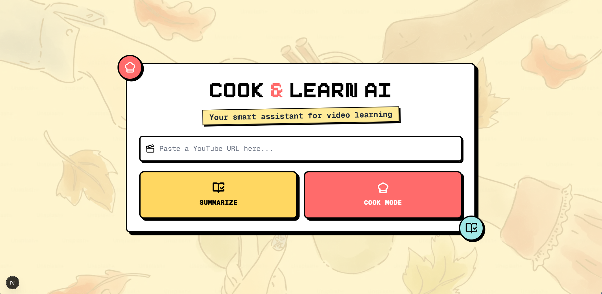
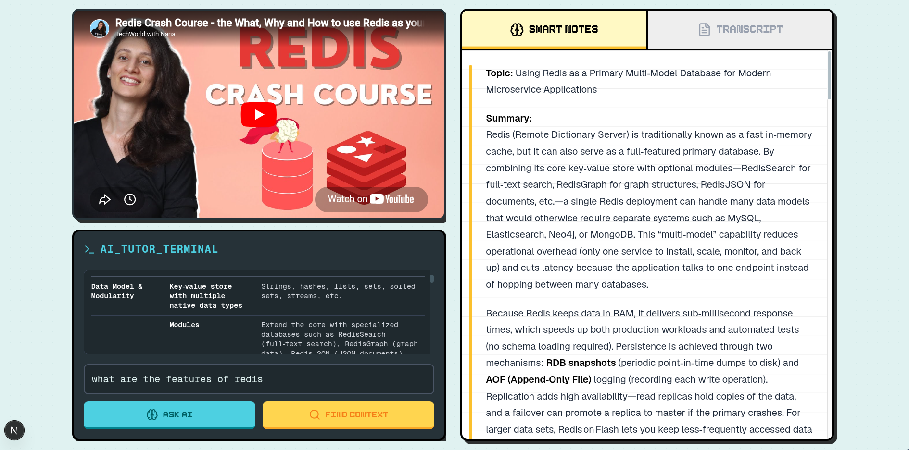
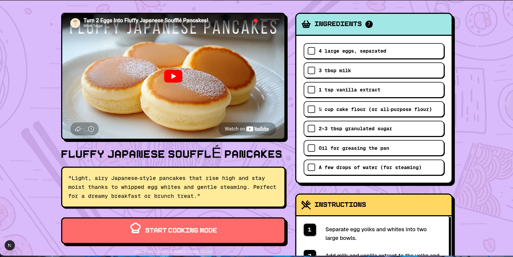
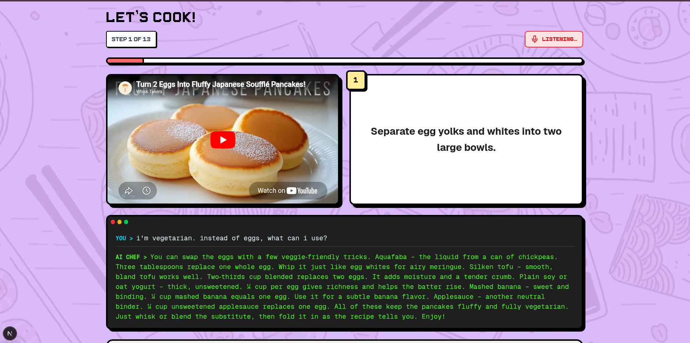

# 🍳 Cook & Learn AI

**Cook & Learn AI** is an AI-powered web application that helps users **learn from YouTube videos** in two powerful ways:

- 📚 **Lecture Summarization & AI Tutor**  
  Generate topic-wise summaries from YouTube lectures, then ask follow-up questions answered from the transcript via semantic search.
  
- 👩‍🍳 **Voice-Controlled Cooking Assistant**  
  Extract step-by-step instructions from cooking videos and guide users using voice commands.

---

## 🚀 Features

- **YouTube Transcript Summarization** using **GPT-OSS-120B (free) via OpenRouter**
- **Semantic Search & AI Tutor Q&A** powered by **Redis** as the vector store with **Cohere embeddings through LangChain**
- **Voice-Controlled Cooking Assistant** using **Deepgram** (live STT and TTS)
- **Real-time Q&A** from video content using **GPT-OSS-120B via OpenRouter**
- Built with **Next.js** and **Tailwind CSS**

---

## 🛠 Tech Stack

- **Framework**: Next.js (Full Stack with App Router)
- **Languages**: TypeScript
- **Styling**: Tailwind CSS  
- **AI & APIs**: OpenRouter (gpt-oss-120b:free), LangChain, Cohere (from LangChain), Deepgram
- **Vector DB**: Redis Cloud
- **Dev Tools**: Git, Postman, Visual Studio Code, npm

---

## 📦 Installation

```bash
# 1. Clone the repository
git clone https://github.com/Anushka404/Cook-Learn-AI.git
cd Cook-Learn-AI

# 2. Install dependencies
npm install

# 3. Add environment variables
# Create a `.env.local` file in the root directory and add:
OPENROUTER_API_KEY=your_openrouter_key
REDIS_URL=your_redis_url
RAPIDAPI_KEY=your_rapidapi_key
COHERE_API_KEY=your_cohere_key
DEEPGRAM_API_KEY=your_deepgram_key

# Auth (Clerk) — required to run
NEXT_PUBLIC_CLERK_PUBLISHABLE_KEY=pk_test_...
CLERK_SECRET_KEY=sk_test_...
NEXT_PUBLIC_CLERK_SIGN_IN_URL=/sign-in
NEXT_PUBLIC_CLERK_SIGN_UP_URL=/sign-up

# Rate limiting (Upstash Redis) — optional; if unset, limiting is disabled (dev fail-open)
UPSTASH_REDIS_REST_URL=your_upstash_rest_url
UPSTASH_REDIS_REST_TOKEN=your_upstash_rest_token

# 4. Run the development server
npm run dev
```

Then open [http://localhost:3000](http://localhost:3000).

---

## 📸 Screenshots

| Home | Lecture Mode | Cook Mode |
|------|--------------|-----------|
|  |  |  |

| Voice Cooking Assistant |
|-------------------------|
|  |

---

## 📄 License

MIT — see [LICENSE](LICENSE).
